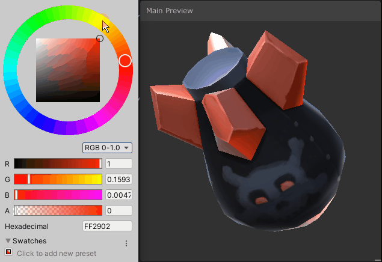
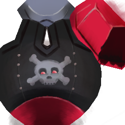
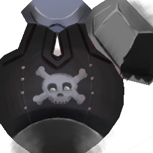
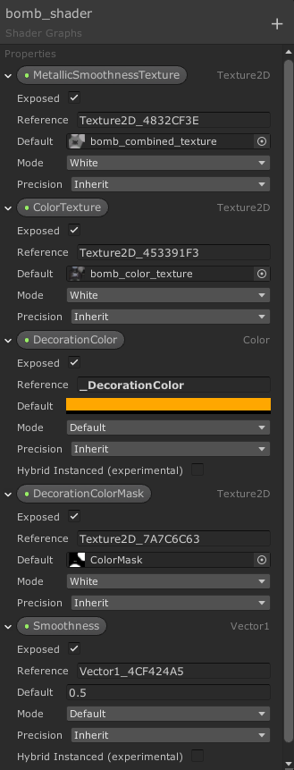
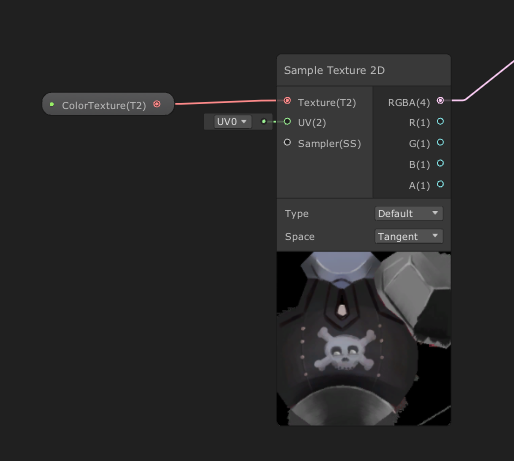
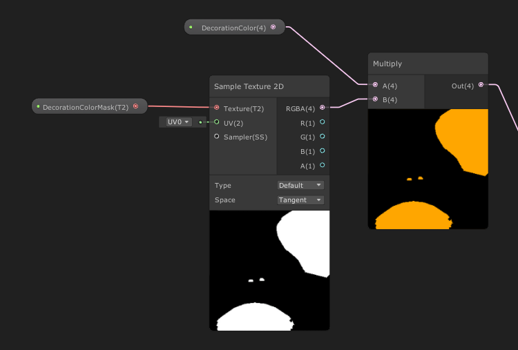
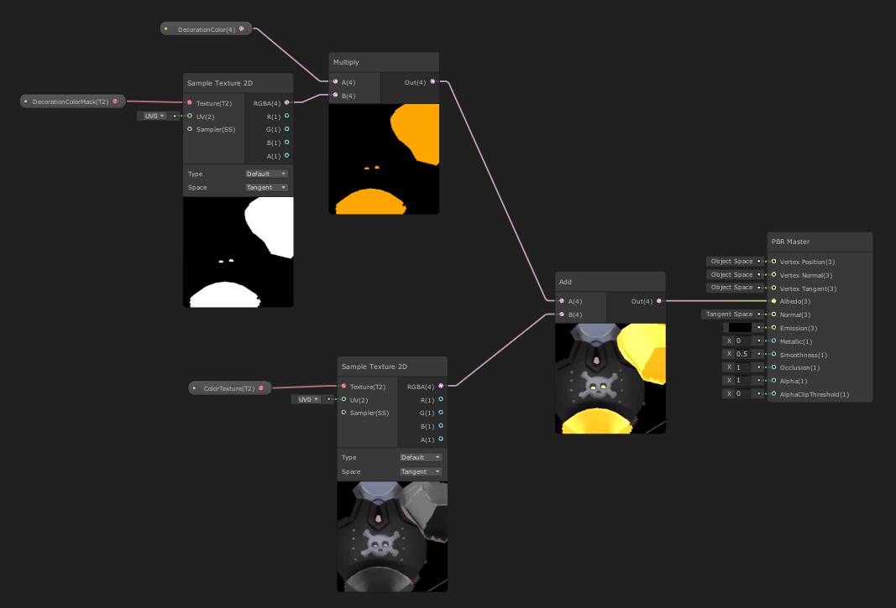
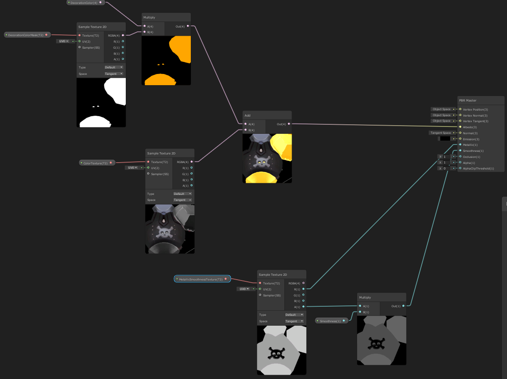

+++
title = "Unity: Controlling the Color of Parts of a Texture with a Color Mask"
highlight = true
math = false
description = " "
image = ""
post_type = ["gamedev"]
see_more_link = "/post/"
date = "2020-09-03T18:03:01+01:00"
thumbnail = "thumbnails/demo-color-change.gif"
images = ["img/thumbnails/demo-color-change.gif"]
[header]
image = "thumbnails/cloudy_aurora_1.1.14.jpg"
caption = ""

+++


## What you will learn 
In this tutorial you will learn how to make a shader with the Shader Graph so you can modify the color of part of a texture like this:


I used this methods to control the colors of the plane and of the bombs' fin in my recent game [The Prabbits: Happy Dogfights!](https://gamejolt.com/games/prabbits-dogfights/433068) Here you see myself playing around with the newly colored bomb :)
<iframe width="800" height="400" src="https://www.youtube.com/embed/5-uObavYhvw" frameborder="0" allow="accelerometer; autoplay; encrypted-media; gyroscope; picture-in-picture" allowfullscreen></iframe>


## Color Mask with Unity Shader Graph

When your object is made of multiple materials, it is easy to change the colour of its parts. However, most of the time, we try to keep the number of materials on screen low for performance reason. In that case the color information is within a texture and if you want to offer **several colors** of a same object, you might be tempted to make **several textures** altogether. 

If you plan to support few colors, it is totally fine, but what if you want the player to be able to pick **any color**?

As the colour information of my bomb (or plane) is contained in a texture, we need to solve the problem with a custom shader, and it is actually easier than what I thought it would be to implement, thanks to **Unity Graph Shader**. 


## Steps:

1) In your 2D software make sure that the texture is in black and white where you want the color to be applied

Before:



After:



2) In your 2D software, create a new image (or layer) with a black background and paint in white where the color should be applied:


3) In Unity's Project panel, right click in one of your asset folders and select `Create > Shader > PBR Graph`, then double-click on the newly created asset. That should open up the Graph Shader.


4) Cliking on the + button, create the following exposed variables:

 


5) Create a Sample Texture 2D node and attach it to the ColorTexture (i.e. hitting "spacebar", start writing "Sample Text..." and select the node).



6) Create a Sample Texture 2D node and attach it to the ColorMask,

7) Create a Multiply node and attach the DecorationColor node and Sample Texture 2D to it,



8) Combine the two branches with a Add node and connect the result to the Albedo channel of the PBR Master node:




And you are done!


9) *[Optional]* You can also add a Smoothness and Roughness texture to the PBR Master node as I did below (note that I stored the Smoothness information in the alpha channel of my texture):




So, that's it! You should be able to control the color of your object using the DecorationColor variable!

In a script, assuming that your color is stored in `m_PlayerColor`, you will need to do:

```c#
this.gameObject.GetComponent<Renderer>().material.SetColor("_DecorationColor", m_PlayerColor);
```


I hope this helps you in your game development, don't hesitate to share other methods in the comment below :slightly_smiling_face: 

See you around!