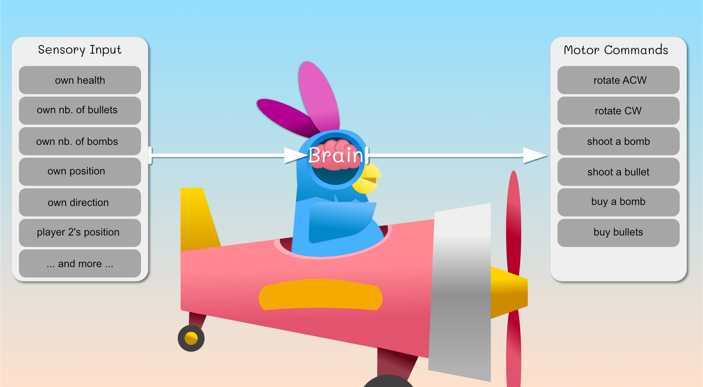
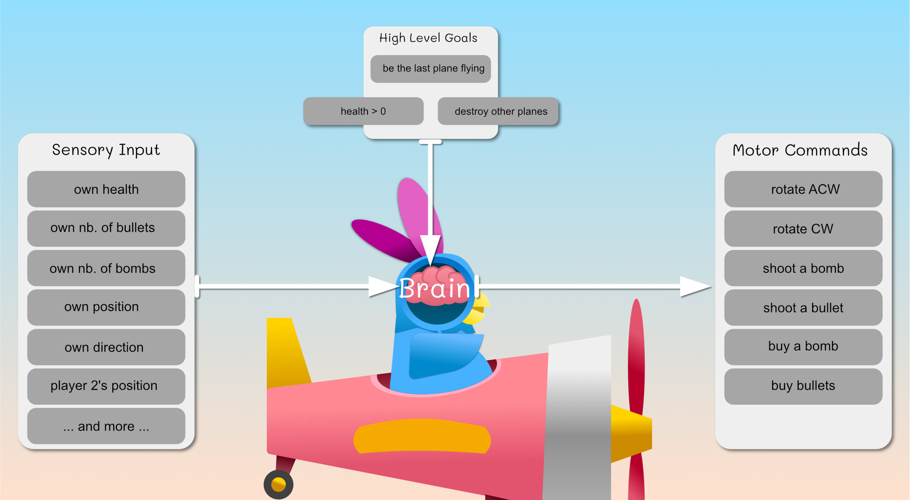
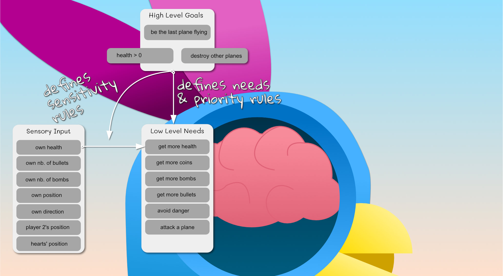
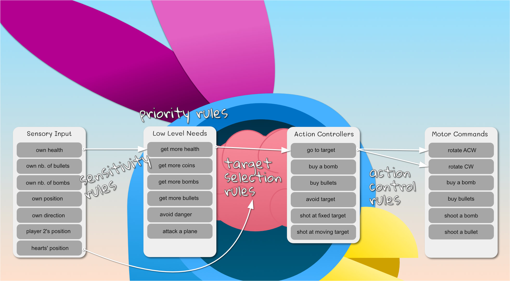

+++
title = "Building an AI for my game - Part 1: Breaking down the problem"
highlight = true
math = false
summary = " "
image = ""
post_type = ["gamedev"]
see_more_link = "/post/"
date = "2020-01-11T13:47:08+01:00"
thumbnail = "thumbnails/ai_blogpost1.jpg"
[header]
image = "prabbit-aviator-banner.png"
caption = ""
+++

I realised that my game needed a single player mode so that players can give it a try easily, or can play the game until they get some friends to come over (or to meet them online). So here we go, I am programming an AI for the prabbits; that I called the prab-bot!


NOTE: I have a Neuroscience background, but I am far from being an expert in AI!


## Transforming inputs into meaningful actions

A brain, or an AI, is essentially an entity that transforms sensory information (i.e. inputs) into motor commands (i.e. outputs). To be intelligent, its sensory to motor transformation should be optimising relevant needs or goals (e.g. surviving, reproducing, etc). 


In research, there is a distinction between making a decision, selecting an action and controlling an action. 

Here a real-life example: you feel thirst (sensory information) and decide you need to drink water as soon as possible (i.e. prioritisation of needs). The action selection comes afterwards: you could stand, take a glass and fill it with water, you could ask your partner to bring you water, or you could simply reach for the glass filled with water in front of you. 
Once you decided that to reach for the glass is the best action to take comes the action control. Action control is how the goal (glass position in space) is transformed into contractions of your arm muscle so that your hand reaches it and grab it. 

In some cases, as in deciding where to look at, the sensory information, decision making, action selection and action control are all really entangled and there might be several pathways in competitions; but for our game, we will keep thing simple.

In our game, we (as a brain designer) can confer the prab-bots multiple **sensory inputs** and multiple **motor commands**.  




We could probably make the prab-bots more human if you designed their sensors so that they cannot pay attention to all of them at the same time. For instance, a human will mainly look at one thing at a time on the screen; but let's keep thing simple for now.


To design an AI is about transforming the **sensory inputs** into **motor commands** so that the prab-bots achieve some goal; that we will call **high-level goals**. 


In Machine Learning, one could connect the **sensory inputs** to the input neurons of a deep neural network, and connect the output neurons to the **motor commands**. The *high-level goals* I am speaking about would be used to punish or reward the network during its training. We are not going to use machine learning though; we are going to design the AI ourselves.


To make decisions, you need **high-level goals** to fulfill, which can be as simple as:

- be the last plane flying
  - 1) Health must be kept always greater than 0
  - 2) Destroy other's plane




To optimise the above needs may not "mathematically" lead you to win the competition; to win the competition you need to eliminate whoever is ahead with a bomb, so they lose their advantage. However, most "human beginners" will just focus on destroying other's planes.


Based on the **high-level goals** and on the *sensory inputs*, we can design **low-level needs** and *prioritisation rules*. These **low-level needs** are a step closer to actual actions, they can be:

- get more health 
- get more bullets 
- get more bomb
- avoid something
- try to attack someone

The **high-level goals** will also define the sensitivity rules that link *sensory inputs* and **low-level needs**. For instance: a decrease of *"own health"* will increase the need *"get more health"*. 



In practice, some of these **low-level needs** can translate directly into a simple action. For instance, if our prab-bot decided to prioritise the low-level need *"get more health"*, the next question is which *"heart"* to go to? this step is the **target selection**: based on its sensory-motor information, the prab-bot will select which heart is the most beneficial to go to; this is the final step before an actual movement can start. As our prab-bot has access to its position and the hearts' position, the target selection can be as simple as finding the closest heart. For a human-like behaviour, you'd need to consider that a human doesn't always pay attention to everything that happens on the screen, and it is a bit more complicated.

Now that we have a target to reach, the final step is the **action control**. This is about transforming the action *"go to target"* into motor commands (i.e. movements) that achieve the goal of that action. For instance, to get a heart, the **action controller** needs to use the **sensory inputs** (e.g. the plane direction, the heart position) and **motor commands** (i.e. rotate the plane CCW/ACW) in order to align the plane with the heart position, then the action controller will wait until the plane reaches it. If there is no obstacle, these rules should do great.

In summary, the low-level need *"get more life"* will lead to the target selection *"selecting a heart"* and then execute the action *"go to target"* using the motor commands *"rotate ACW/CW"*. 



Even if the above already sounds a bit complicated, it was in fact a simple case :) ! Indeed, some **low-level needs** such as *get more bullets* can lead to a series of simple actions and small decisions: 

```python
if (enough money):
   execute the action "buy bullets" # which triggers the motor command "buy bullet"
else:
  1. prioritise need "get more coins":
     1. target selection "selection of a coin", 
     2. execute action "go to target" 
     3. repeat until enough coins
  2. prioritise need 'buy bullet':
     1. execute the action "buy bullets" # which triggers the motor command "buy bullet"
```

Furthermore, although the brain mostly executes one action at a time (multi-tasking is complicated), it can execute actions that account for multiple **low-level needs** at the same time, or execute the current action in a way that prepares us to the second action. For instance:

- you can reach for a heart while avoiding a bomb: you are executing an action that optimises two constraints (an attractor and a repeller)
- you can get to a heart while approaching it in a direction that aligns you with a coin, so that you ease  the execution of your next action (collecting coins)

Finally, to add to the complexity, the environment may change (i.e. there is no heart anymore on the map) while you are executing your action. This will change the ranking of your **low-level needs** and make the current action irrelevant.

I think this is it for our introduction to IA :) we had a really good think on how to model the decision making that transforms the sensory input of our prab-bots into actions that are relevant for a high-level goal (i.e. to win the round). The framework I try to put together may not be perfect but it is a good start in putting words on things and encapsulating our general AI problem into smaller parts. Our next tutorial will be on creating the action controllers. See you next time!


