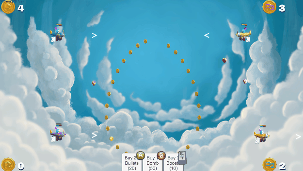
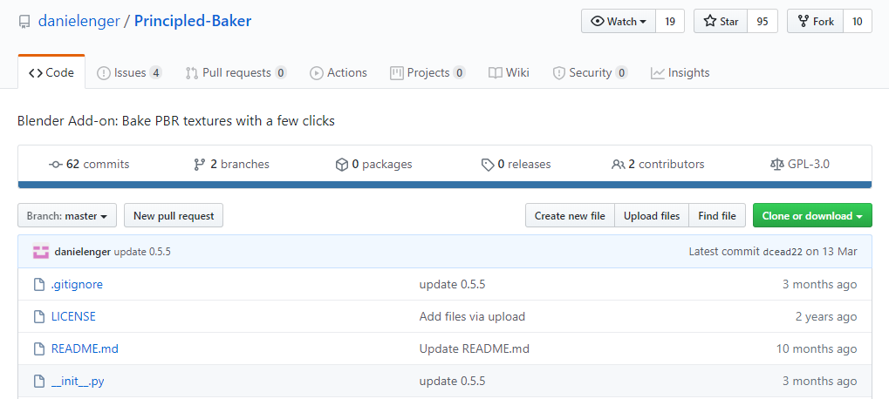
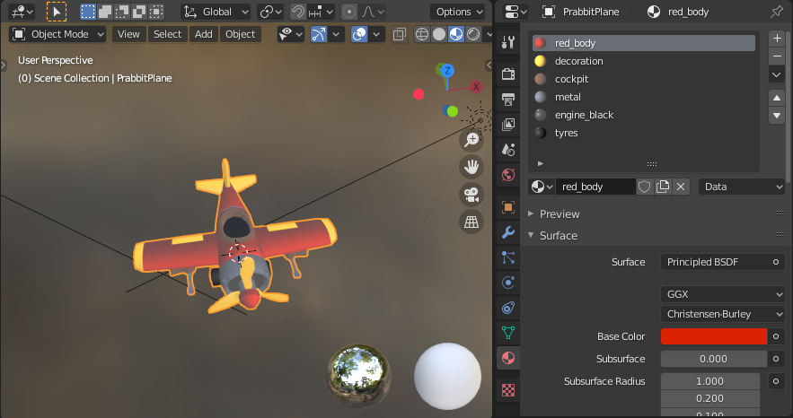
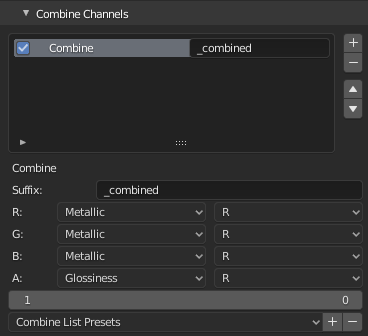
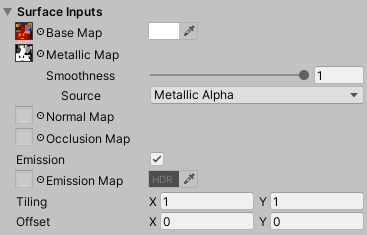
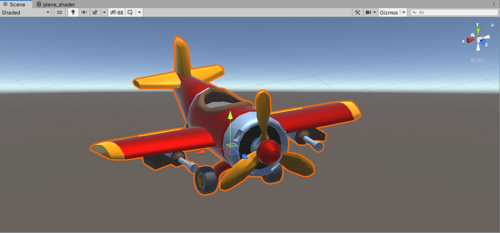

+++
title = "Baking PBR Materials to Textures from Blender to Unity"
highlight = true
math = false
description = " "
image = ""
post_type = ["gamedev"]
see_more_link = "/post/"
date = "2020-06-12T10:50:01+01:00"
thumbnail = "thumbnails/pbr_blender_to_unity.png"
images = ["thumbnails/pbr_blender_to_unity.png"]
[header]
image = "thumbnails/pbr_blender_to_unity.png"
caption = ""
+++

## Multiple Materials to Baked Textures

Until now the planes in Happy Dogfights were made of multiple materials so that it was easy to change the color of the plane in Unity. When a player select a color, I just modify the color of the material used for the body of the plane. It also made sense when working in Blender to have a different material for the tyres, the body, the engine, etc, so that I could control their metalness, roughness, and color  independently. 

However, this method has its limitations: 

- it is not optimal in terms of real-time rendering
- I could not apply surface shaders VFX, like flame or electricity effects, on the plane. 
- the PBR parameters (e.g. color, roughness, metalness, emission) were not imported by Unity, I had to enter them manually
- I could not use complex procedural materials in Blender (as I could not export them)

A better but more involved method is to unwrap the plane's UV, and bake all the materials into PBR textures so that the plane only use one material. 

This way I could benefit from:

- better performance using a unique material for the plane
- an automatic import  of the PBR parameters (color, roughness, etc) as they are saved in a texture
- surface shader VFX as the UV are unwrapped
- I can work with multiple and procedural materials in Blender

But for that to happen, I needed to find a way to bake the materials! 

In this tutorial, I am covering that problem: how to bake multiple procedural material into texture in Blender, in a way that is compatible with Unity. In a future tutorial, I will cover how to change the color of the plane when its color information is stored in a texture.

## Step by Step Tutorial

1. Get the Free and Open Source add-on of Daniel Enger.

   - Go to the Github repository at https://github.com/danielenger/Principled-Baker:

     

   - Download the repository as a zip-file.

2. Install the Add-on: 

   - In Blender, go in  `Edit > Preferences > Add-ons`, click `Install...`,

   - find the zip file you just downloaded, click `Install Add-on`.

     

3. Find the Add-on:

   

   - Go to the `Shading tab`, hover the mouse over the Shader Editor, and press <kbd>N</kbd> , 
   - Click on the tab `Principled Baker`

4. Use the Add-on:

   - Select the object to baked

   - Deselect `Autodetect`, tick `Color`, `Metallic` and `Roughness`.

     

   - In Additional Bake Types, tick `Glossiness`, this is what Unity calls Smoothness (i.e. 1 - roughness) 

   - Scroll down and find `Combine Channel`, and click `+` (in Unity, the metal map includes the roughness map as alpha channel)

   - Set the Channels as follow:

     

   - Scroll up and click bake!

Now if you export the plane as FBX without materials and import it in Unity. Create a material where you use the color texture as base map, the combined texture as metallic map. 

You should get your object with the materials looking as they do in Blender.

## Next Steps

Now that the different colors of the plane are contained in a texture, it will be more complicated to change its color :sweat_smile: but worry not, the problem can be solved with a custom shader, and it is easy to implement with the Graph Shader. See you next week!